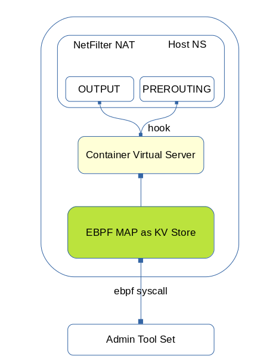

# The CVS project

By CVS, I mean "Container Virtual Servers",  is a POC(Prove Of Concept) project implementing kernal space load balancer based on netfilter framework and ebpf MAPs, solely used for container environment.


## Why this
* Random access data structure with O(1) time complexity selecting real ip, compared with O(log(n)) for iptables
* No need to add vip to a dummy interface to make load balancer work in a container environment, as k8s/docker swarm does to make use of ipvs.


## The design is simple

* ebpf MAPs are used as in-kernel data structure storing vip-rip bindings.
* netfilter framework nat PREROUTING/OUTPUT hook to make DNAT




## Build

### Requirements
* build-essential to build
* kernel 5+ (My test run only on latest kernel 5.19)


### User space admin tool
```gcc ./cmd/main.c -o cvsadm```


### Kernel module
```cd module && make```


### Install kernel module
```cd module && insmod cvs.ko```


### Uninstall kernel module
```rmmod cvs```


## Usage

```
# add new vip-rip bindings
cvsadm push 10.10.0.1 192.168.0.2
cvsadm push 10.10.0.1 192.168.0.3
cvsadm push 10.10.0.1 192.168.0.4
# show vip-rip bindings for specific vip
cvsadm list 10.10.0.1
# remove the last rip for specific vip
csvadm pop 10.10.0.1
# Then 192.168.0.2/3/4 would be access via 10.10.0.1 on host or inside another container
```

The kernel module, when receive a package with destination ip address set to 10.10.0.1(vip), it would randomly select a rip, and change the destination ip to the selected rip.


## Future Works

* To access ebpf MAP inside another kernel module, current implementation actually uses a `hack` copied from ebpf helpers, it should be changed to a public interface supplied by ebpf when available.
* Lots of other stuff...
 
